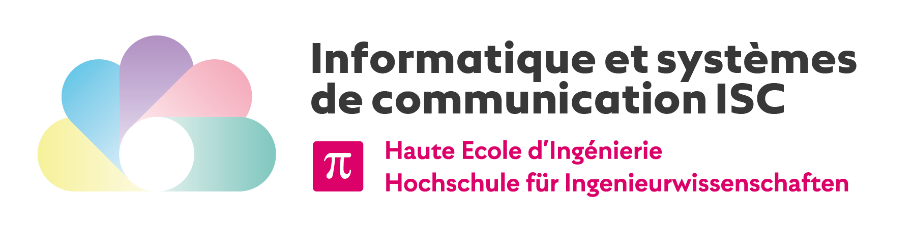

Fast and Precise is a game coded in Scala based on the `ZType` game which tests our ability to write on a keyboard.

## Goal

This project was made for the 101.2 - Object-oriented programming course in ISC first year program.

## Tutorial

To play the Fast and Precise GAME,

1. Open the `Main.scala` file.

2. On the menu click on start

3. Type the different letters to fill a word.

4. For every word you have 10 seconds before it falls down and stops the game.

5. Every next round contains one more word to type on.

5. To go to the next round, you have to write every word shown on the screen.

5. The score is based on the speed you write the words and the number of achieved rounds.

5. Enjoy and make the best score possible!

