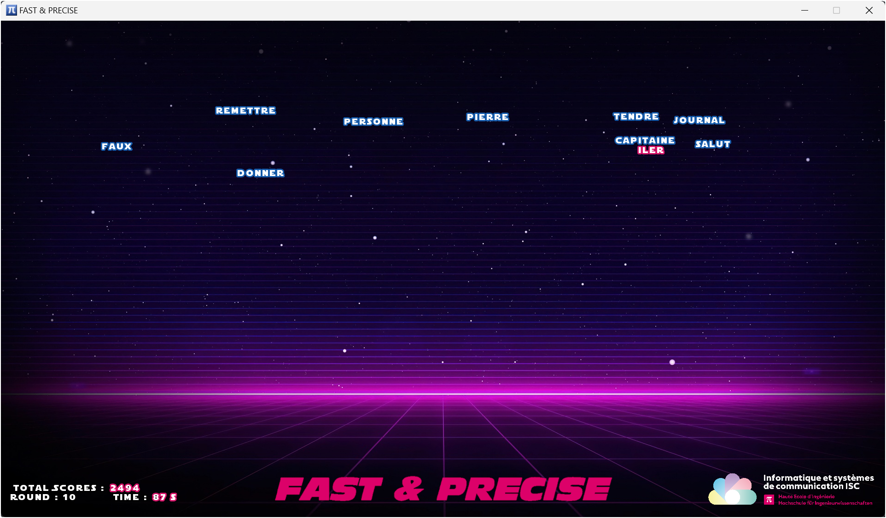

Fast and Precise is a game coded in Scala based on the `ZType` game which tests our ability to write on a keyboard.

## Goal

This project was made for the 101.2 - Object-oriented programming course in ISC first year program.

## Screenshots

### Game start

### In Game

### GAME OVER

## Tutorial

To play the Fast and Precise GAME,

1. Open the `Main.scala` file in your IDE (IntelliJ is preferred)
2. Type the different letters to fill a word.
3. For every word you have `18 seconds` before it falls down and stops the game.
4. Every next round contains one more word to type on.
5. To go to the next round, you have to write every word shown on the screen.
6. If you lose, you can always replay by clicking on `y`.
7. Enjoy and make the best score possible!

## Sources
Background used in the game can be found here : https://4kwallpapers.com/abstract/outrun-neon-dark-background-purple-4523.html